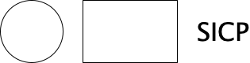

#+title: SICP Notes
#+author: Carlo
#+startup: overview inlineimages
#+property: header-args:racket :results output
#+property: header-args:scheme :cmd "racket" :results value :session sicp

* Environment / Smoke Tests

Keep this section collapsed during normal study. It only verifies the setup.

** Racket Setup Check

#+begin_src shell :results output
pwd
racket --version
#+end_src

#+RESULTS:
: /Users/spartacoosh/Code/SICP/SICP
: Welcome to Racket v9.1 [cs].

** Hello SICP

#+begin_src racket :lang sicp :results output
(define (square x) (* x x))

(display (square 5)) (newline)
#+end_src

#+RESULTS:
: 25

** Inline Picture Rendering

#+begin_src racket :lang racket :results file graphics :file images/hello-pict.png
(require pict)

(define drawing
  (cc-superimpose
   (filled-rectangle 360 140 #:color "white" #:draw-border? #f)
   (hc-append
    24
    (circle 80)
    (rectangle 120 80)
    (text "SICP" null 32))))

(send (pict->bitmap drawing) save-file "images/hello-pict.png" 'png)

"images/hello-pict.png"
#+end_src

#+RESULTS:

** sicp-pict Availability

#+begin_src racket :lang racket :results output
(require sicp-pict)

(display "sicp-pict loaded")
(newline)
#+end_src

#+RESULTS:
: sicp-pict loaded

* Book Notes

** Chapter 1 — Building Abstractions with Procedures

*** 1.1 The Elements of Programming

Notes here.

#+begin_src racket :lang sicp :results output
;; Scratch code here.
#+end_src

** Chapter 2 — Building Abstractions with Data

*** Notes

** Chapter 3 — Modularity, Objects, and State

*** Notes

** Chapter 4 — Metalinguistic Abstraction

*** Notes

** Chapter 5 — Computing with Register Machines

*** Notes

* Lecture Notes

** Lecture 1A — Overview and Introduction to Lisp

*** Notes
Computer Science = not about science, not about computers. Similar to
how geometry is not really about surverying instruments or earth
measurement.  How to identify when something is an instance of a more
general thing (i.e. fixed point finding of f(y) = avg(y, x/y) ==
method for finding square roots).

**** Black-Box Abstraction

Primitive Objects
- Primitive procedures
- Primitive data

Means of Combination
- Procedure composition
- Construction of compund data

Means of Abstraction
- Procedure definition
- Simple data abstraction

Capturing Common Patterns
- High-order procedures
- Data as procedures

Linear Combinations

The abstract pattern: ~(* x (+ a1 a2 ...))~ — scale the sum of things.

This single expression captures something profound. Whether =a1=, =a2= are
*numbers*, *vectors*, *polynomials*, or *electrical signals* being summed and
amplified — the /shape/ of the operation is identical. This is the
general notion of a linear combination, and a powerful language should
express that generality directly.

The catch: the /concrete machinery/ of addition and multiplication
differs across types. Somewhere, something must know how to add
polynomials vs. vectors vs. signals. The design question is: *where
does that knowledge live, and how do we make it extensible?* If George
invents a new algebraic type tomorrow, can we support it without
breaking everything?

This forces us toward two powerful techniques:

*1. Conventional interfaces* — agreed-upon contracts for hooking
heterogeneous things together. /(Topic 2)/

*2. Language-oriented design* — rather than patching a language, /design
a new one/ that foregrounds the aspects of the problem you care about
while suppressing irrelevant detail. /(Topic 3)/

To make this concrete, we'll build a Lisp interpreter — a beautifully
recursive process where ~eval~ and ~apply~ chase each other's tails. This
leads us to *metalinguistic abstraction*: the idea that designing
languages /is/ the abstraction, bottoming out at the Y combinator — the
strange loop that gives a language its notion of infinity.

#+begin_src racket :lang sicp :results output
(* 2 (+ 1 3))
#+end_src

#+RESULTS:
: 8

Elements of a Language

When evaluating a new language, ask three questions:

1. *Primitive elements* — what are the atomic building blocks?
2. *Means of combination* — how do you build compound things from simpler ones?
3. *Means of abstraction* — how do you treat compound things as new primitives?

The /wrong/ framing: "how many characters to invert a matrix?"
The /right/ framing: "if matrices weren't built in, could I construct them?
and could I then abstract over them as if they were primitive?"

#+BEGIN_EXAMPLE
Combination: (+   3 17.4 5)
              |   |______|
           operator operands

Nested: (* x (+ a1 a2))
         | |  |______|
         | |  combination (as operand)
         | operand
         operator

Operands can themselves be combinations — this is the recursive power of the notation.
#+END_EXAMPLE

Prefix Notation & Syntax Trees

In Lisp, the operator is always written *left of its operands* — this is
prefix notation. Every combination is *fully parenthesized*, making it
unambiguous, unlike math where parentheses are optional/decorative.

In Lisp, parentheses mean exactly one thing: /this is a combination/.
The best way to internalize this is to think of them as syntax trees:

#+BEGIN_EXAMPLE
(* (+ 2 3) (- 8 1))

          *
         / \
        +   -
       / \ / \
      2  3 8  1
#+END_EXAMPLE

Each node is an operator; its children are its operands. The parenthesized
expression and the tree are /the same thing/ — just two notations for an
identical structure. There is no ambiguity because the tree has only one
valid reading.

Expressions & Definitions

#+begin_src racket :lang sicp :results output
3
(+ 3 4 8)
(+ (* 3 (+ 7 19.5)) 4)
(+ (* 3 5) (* 47 (- 20 6.8)) 12)
#+end_src

#+RESULTS:
: 3
: 15
: 83.5
: 647.4

*Naming values* with ~define~:

#+begin_src racket :lang sicp :results output
(define A (* 5 5))
(* A A)
(define B (+ A (* 5 A)))
B
(+ A (/ B 5))
#+end_src

#+RESULTS:
: 625
: 150
: 55

Defining Procedures

#+begin_src racket :lang sicp :results output
(define (square x) (* x x))          ; syntactic sugar for:
(define square (lambda (x) (* x x))) ; a name bound to a procedure
(define (average x y) (/ (+ x y) 2))
(define (mean-square x y) (average (square x) (square y)))
(mean-square 2 3)
#+end_src

#+RESULTS:
: 13/2

*No distinction between built-ins and your own abstractions* — ~square~
is usable exactly as if the language had always had it.

Case Analysis

#+BEGIN_EXAMPLE
       ⎧ -x   if x < 0
|x| =  ⎨  0   if x = 0
       ⎩  x   if x > 0
#+END_EXAMPLE

#+begin_src racket :lang sicp :results output
(define (abs x)
  (cond ((< x 0) (- x))   ; general: n branches
        ((= x 0) 0)
        ((> x 0) x)))

(define (abs x)
  (if (< x 0) (- x) x))   ; sugar for the single-predicate case
#+end_src
  
Recursion & Block Structure

This covers the majority of Lisp syntax we'll need — and if you're coming
from C/Fortran, that may be surprising: no ~while~, no ~for~. We don't
need them. Iteration emerges naturally from recursion.

Consider Heron of Alexandria's sqrt algorithm:
1. Make a guess G
2. Improve it: average G and X/G
3. Repeat until good enough
4. Start with G = 1

#+begin_src racket :lang sicp :results output
(define (improve guess x)   (average guess (/ x guess)))
(define (good-enough? guess x) (< (abs (- (square guess) x)) .001))
(define (try guess x)
  (if (good-enough? guess x)
      guess
      (try (improve guess x) x)))
(define (sqrt x) (try 1 x))
#+end_src

~try~ is a /recursive definition/ — it is defined in terms of itself.
The call tree and iteration look like:

#+BEGIN_EXAMPLE
       SQRT
         |
        TRY <─────────┐
       /   \          │
      v     v         │
 GOOD-    IMPROVE ────┘
ENOUGH?      |
             v
           AVERAGE

(try 1.5 2)
  → (try (average 1.5 (/ 2 1.5)) 2)
  → (try 1.41667 2)
  → ...
  → 1.41421568
#+END_EXAMPLE

Block Structure

We can package ~try~, ~good-enough?~, and ~improve~ /inside/ ~sqrt~ —
hiding them from the outside world:

#+begin_src racket :lang sicp :results output
(define (sqrt x)
  (define (improve guess)     (average guess (/ x guess)))
  (define (good-enough? guess)(< (abs (- (square guess) x)) .001))
  (define (try guess)
    (if (good-enough? guess)
        guess
        (try (improve guess))))
  (try 1))
#+end_src

~x~ is shared by all inner procedures via /lexical scoping/ — no need to
pass it around. George can use ~sqrt~ as a black box without knowing
~try~, ~improve~, or ~good-enough?~ exist. This is what we mean by
*means of abstraction*.

Summary: What Lisp Gives Us

#+BEGIN_EXAMPLE
+──────────────────+──────────────────+───────────────+
|                  | PROCEDURES       | DATA          |
+──────────────────+──────────────────+───────────────+
| PRIMITIVE        | + * < =          | 23  1.738     |
| ELEMENTS         |                  |               |
+──────────────────+──────────────────+───────────────+
| MEANS OF         | () cond if       |               |
| COMBINATION      | lambda           |               |
+──────────────────+──────────────────+───────────────+
| MEANS OF         | define           |               |
| ABSTRACTION      | block structure  |               |
+──────────────────+──────────────────+───────────────+
#+END_EXAMPLE

Finally, note the crucial distinction between naming a /value/ vs. a
/procedure/:

#+begin_src racket :lang sicp :results output
(define A (* 5 5))    ; evaluated immediately → 25
(define (D) (* 5 5))  ; a procedure, not yet called

A    ; → 25
D    ; → #<procedure:D>
(D)  ; → 25
#+end_src

~A~ is a number. ~D~ is a procedure that /produces/ a number when called.

**** Conventional Interfaces 
T
Conventional Interfaces

Generic Operations 

Large-scale Structure and Modularity 

Object-Oriented Programming 

Operations on Aggregates ("Streams")

**** Metalinguistic Abstraction 

*** Scratch

#+begin_src racket :lang sicp :results output
;; Lecture scratch code here.
#+end_src

** Lecture 1B — Procedures and Processes

*** Notes

** Lecture 2A — Higher-Order Procedures

*** Notes

* Picture Experiments

Use ordinary Racket =pict= for Org-inline image generation.

** Basic pict Scratch

#+begin_src racket :lang racket :results file graphics :file images/basic-pict.png
(require pict)

(define drawing (cc-superimpose (filled-rectangle 300 140 #:color
"white" #:draw-border? #f) (hc-append 20 (circle 80) (rectangle 100
80))))

(send (pict->bitmap drawing) save-file "images/basic-pict.png" 'png)

"images/basic-pict.png"
#+end_src

* Scratchpad

Temporary experiments go here.

** Scratch

#+begin_src racket :lang sicp :results output
(display "scratch") (newline)
#+end_src
